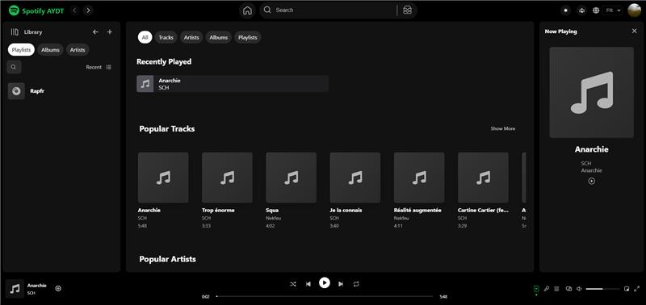

# Liens des vidéos youTube pour valider le projet

## Backoffice

- <a href="https://youtu.be/7zRlJe0QhDU" target="_blank">Spotify AYDT Graphes pour les metrics</a>
- <a href="https://youtu.be/GJvd0oEIj3E" target="_blank">Lier les sons aux albums</a>
- <a href="https://youtu.be/wIcekotdmag" target="_blank">Drag and drop dans les pistes</a>
- <a href="https://youtu.be/vcSP67Drops" target="_blank">Interface améliorée pour création album</a>
- <a href="https://youtu.be/a6G-6cP3HXM" target="_blank">Modification et suppression d'audio</a>
- <a href="https://youtu.be/Ffahjvnd_Sw" target="_blank">Barre de recherche dans les pistes</a>

## Frontend

- <a href="https://youtu.be/Kzov8YRi15M" target="_blank">Multi Language</a>
- <a href="https://youtu.be/akWQd9WrJt0" target="_blank">Image optimisée</a>
- <a href="https://youtu.be/2n5PznpbltM" target="_blank">Responsive mobile</a>
- <a href="https://youtu.be/Exlt5y62qys" target="_blank">Performance LightHouse</a>

## Backend

- <a href="https://youtu.be/XHwi5_tPb5g?si=B8RlVTBUduacWON7" target="_blank">Backend - Jam WebSocket Spotify</a>
- <a href="https://youtu.be/E1P6DI2pBcs?si=hZ_90fCwtP4WkAVU" target="_blank">Backend Spotify Login JWT Token</a>
- <a href="https://youtu.be/ndfKEmIQFYU" target="_blank">Backend - Test Js Spotify</a>

# Spotify AYDT

# 🐼 Spotify AYDT


Un clone de spotify pour ecouter des musiques en ligne.

- [Voir le site](https://spotify-aydt.vercel.app/)

## Aperçu



## Table des matières

- [Installation](#installation)
- [Technologies utilisées](#technologies-utilisées)
- [Structure du projet](#structure-du-projet)
- [Fonctionnalités](#fonctionnalités)

## Installation

Assurez-vous d'avoir Node.js installé avant de démarrer.

1. Clonez le repository:

```bash
git clone https://github.com/zkerkeb-class/app-front-projet-final-spotifyaydt.git
```

2. Accédez au répertoire du projet:

```bash
cd app-front-projet-final-spotifyaydt
```

3. Installez les dépendances de chaques repertoire:

```bash
npm install --legacy-peer-deps
```

4. Démarrez l'api puis demarrer l'application:

```bash
npm run start
```

5. Ouvrez votre navigateur et accédez à http://localhost:3000.

## Technologies utilisées

### Technologies utilisées

- React.js
- SCSS

## Structure du projet

### Pour le front

- /src: Contient les pages du site.
- /pages: Contient les pages du site.
- /context: Contient le contexte de l'application.
- /hooks: Contient les hooks de l'application.
- /utils: Contient les utils de l'application.
- /components: Regroupe les composants réutilisables.
- /public: Ressources statiques telles que les images.

## Fonctionnalités

- Page d'accueil pour visualiser les differentes pistes.
- Ecouter les musiques en ligne.
- Page de recherche pour rechercher une piste.
- Barre de recherche dans les pistes.
